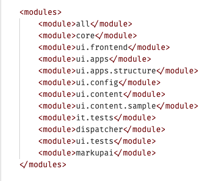
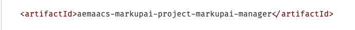
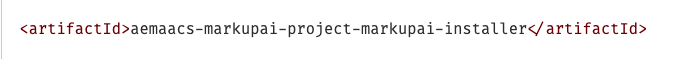
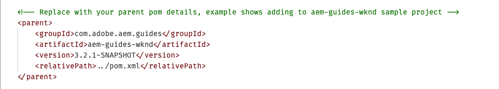

# MarkupAI-Installer-for-AEMaaCS

## Steps for Adding MarkupAI to AEMaaCS

Follow this step-by-step guide to integrate Markup AI to your existing code repository.

## Adding the MarkupAI Module

- Create a clone of your Cloud Manager's Git repository.
- Checkout the code from latest available [Git tag](https://github.com/markupai/MarkupAI-Installer-for-AEMaaCS/tags). (Don't use the `main` branch as it could contain untested changes)
- Copy the MarkupAI module to the root directory of the cloud manager code.
- Update  **/markupai/pom.xml**

  - Replace the parent pom section with your parent's pom details, as shown below:
    - Example shows adding to `aem-guides-wknd` sample project

  

  - Update the artifact Id as per your application's naming convention:

  

- Update  **/markupai/markupai.installer/pom.xml**

  - Update the artifact id as per your application's naming conventions.

  

- Add the MarkupAI module in the parent pom module section.

  

- Add a dependency to `all` module for markupai installer

  In the `all` module's pom.xml add:

  ```xml
  <dependency>
    <groupId>com.markupai</groupId>
    <artifactId>aemaacs-markupai-project-markupai-installer</artifactId>
    <version>0.0.1-SNAPSHOT</version>
    <type>zip</type>
  </dependency>
  ```

  In the plugin section of the `all` module under the `filevault-package-maven-plugin` add an `embedded` section similar to other modules.

  ```xml
  <embeddeds>
    <embedded>
      <groupId>com.markupai</groupId>
      <artifactId>aemaacs-markupai-project-markupai-installer</artifactId>
      <type>zip</type>
      <target>/apps/wknd-packages/application/install</target> <!-- Adjust path as per your project-->
    </embedded>
  </embeddeds>
  ```

## Updating MarkupAI

Update `markupai.version` property in **/markupai/markupai.installer/pom.xml**


## Uninstalling MarkupAI

- Remove the MarkupAI module from your cloud project.
- Remove entries from parent pom.xml in your project.
- Remove cloud configuration for MarkupAI URL, generic token.
- Rerun cloud manager pipeline.

## License

Copyright 2026-present Markup AI

Licensed under the Apache License, Version 2.0 (the "License");
you may not use this file except in compliance with the License.
You may obtain a copy of the License at:

[http://www.apache.org/licenses/LICENSE-2.0](http://www.apache.org/licenses/LICENSE-2.0)

Unless required by applicable law or agreed to in writing, software
distributed under the License is distributed on an "AS IS" BASIS,
WITHOUT WARRANTIES OR CONDITIONS OF ANY KIND, either express or implied.
See the License for the specific language governing permissions and
limitations under the License.

For more information visit: [https://www.markupai.com](https://www.markupai.com)
